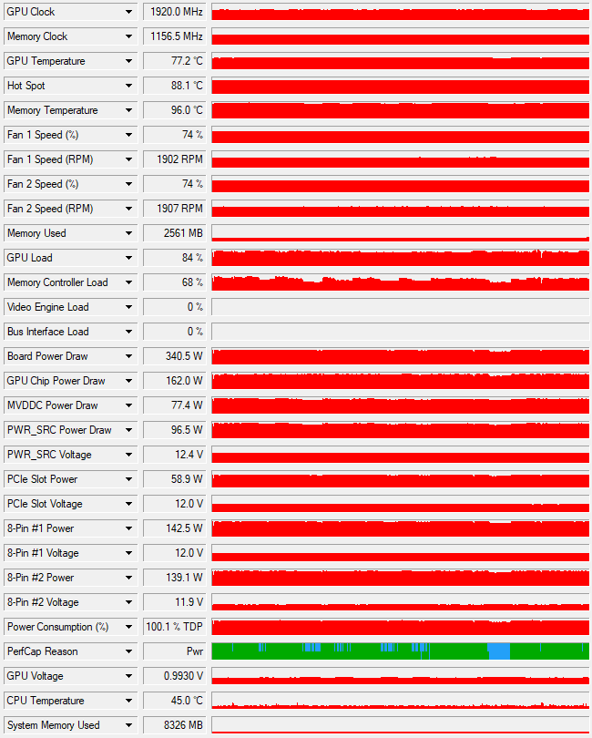

# Bonus Task

I was able to crack an additional 40 passwords using hashcat the the rockyou.txt dictionary.

I installed hashcat on my Windows 11 gaming computer which has an Nvidia RTX 3080.
The only additional software required for hashcat to work with my GPU was Nvidia's CUDA Toolkit.
No other configuration was necessary, hashcat detected my GPU and used it for the hashing calculations.
The RTX 3080 has 8704 CUDA cores which greatly accelerated those hashing calculations.

I first ran hashcat with the 500_password.txt file to ensure it worked properly:
```
hashcat -m 1800 -a 0 c:\hacking\sha512.hashes c:\hacking\500_passwords.txt
```
That returned the same 24 passwords I cracked with John the Ripper for Task 1:
```
$6$b2i7FWpk$exma69Zf1tfnSYbJCJxzK27LpZBkMuo8qPGmMdCAsGBtzfRF0fmQiu/n664U/gLQeGP7KH9muwEJnisp89ti8/:12345678
$6$DnE8uInn$4uH4SVVsFIJXKOPSuIQpNHm88tpSoHqPDxZuRI36ErVWHGo0jPf25yhZExw9ar1qu/tJUt9LUS7iG/C19C5Dv1:password
$6$vEWIa0NL$insEzECqsYBIKMdsfbEjRlzpRSR5JQxatDop8tC.7IWXbeUE/pE3KyYZTy0DV2c2SGGdxZOLgOve3a4e7Izc10:letmein
$6$PlGecK/o$y8OFHRBJe97H1iw7WzGhI.AS8ve7vs1zdeJZFRuDuZMDhA.3ErBQ6tkkcA1XcVKmp.SloE06Q9hxyFaUbveVt.:password
$6$O3fvRdCu$zzIjv0he5/DTymRT4Us0zvkXXye6obCRuCfyKETPVzui91MIr3KGvx6k9ao.sOxCbxmqbxRswGvMvQ8o9tz5N0:password
$6$f8lvvnii$Zq1oEfYixhTaiS8W6BGGnU2.3UZWhxw2Y4UvVgAQdBzN42oMmVbnbfkxOQNPt1v4.kbYDeNG/hfv4iQF7iKBJ1:password
$6$ErwzStgb$46XPUOedyjuNg2ThRRonMW0DrqTxqZtpkAE3MVG80E4FhOI8dFqfVp0incPKxlQhmx6shk59trdjGDBFEK/gY1:password
$6$1Xc/9U.cGg8kxtiC$L1Rk6kWkwh06JXxqHpi5GxfI00oubdbX5kM5OxpY50unI5Za/k1O4hOTiQgdVCMu/eyTBcdWQKjsiasrj8N.Q.:123456
$6$bUF1qmmmDGonX.0X$HAbExdm5WZRTGaI07361koWvhDTR8MThaC6hJJLQ7O3oIER7VLrbVUIvd99FnW72QBW61W/vXH6Jp.FbMGyBH/:password
$6$Ldm3VAeB6p1vZax2$VRYFc1i6bxhCGKcAKJwXAvFkD4mxH7YZcqK4h/4ou5ZeC6GQE7c/f1jmZ0vjvuu3as/B7Jt/oH2FL8VZHujmQ.:12345
$6$lqx9Hy.GlhL3D8xx$FvkFRZ0B/70zJxvLQefcF7J.v6ghcR1MLKgvAOCEtsIU8wqo4nWDWk4.A5kJI4Y74TXSvzZWFyhQsSWsx.u9u1:12345
$6$7HXAxDUQNO.ocghW$Ni0x5kPFXs.KRYaCMnog4BjSaLuQOBTDH4GrDnpvtQrlIPQpUI.5eVKJ/rhwOLnPFpbRTvyXWldU.7WJGRwTC1:pass
$6$wSXBMAKMuxULM1dC$cPVWM8fI1K47.dOv6bIkhhntD/GUK4wvDaqrpV1kSNYC9ZeY4H1gktvBKZNSMThH5vNIl9LomxoYvXM3mwRRw/:12345
$6$XHtJ6FTu9K1tIn1H$7JzZ.eVhmiku/PiD7Nz0F1dNiDc0U2asYb15WRD2.dOQYotgULczOxFsUF5BJ1yvDUNqntGW9I8bRPdlUyPDE.:12345
$6$IzFchSYltRvpJYSc$5551hdvjpF2LrxYBXX078AbAJNHUbMG.1spdOZLgbtsFBCFV.Yuy45030YC.ltp8rQTXf8DSwIPzlqW2GfAo90:password
$6$yo3q9UJCPu5xiZCN$mo4P3AKPViy2mz2OdW0.joXlkg7vELJj5aRZzaAFeZmUWxrWbEQa7.cl5wqCE8JOC2XRjREFUGuJCsrUDxIY4/:12345
$6$ym0uV.otwn8ZIl0X$EtlCRSBBAf06JptkncddyiFi.KyVBVxXqFT6b7aiaUvdsDrynXiPZ.DDzo1znnaii8buVFw3J257t5opfMtXD0:1234
$6$iTUu/aBlPMZ4p5Wl$yR1RN1pviu0QzW5yqm4g2Mfo.CllrP3pajIF3.TAHb4n6H6N80KRSOuJf7jd.Tz41Pyq3TAvA/rfwiGZhGy.a.:password
$6$2gyyBNXhzF9eqPnj$oyHAFWC8NY4.GIqucyfI0ynk2eY6RiOCS88Yd2y.QlPTxKmQk.KUKt.rpLPgPg9bUH9qeJAcI6ImeSvW8Pdmc0:12345
$6$Bx7JzDCLX6Pdp3tu$rDNuityKBfPwkaDOYMK2qnDfrDDVbN93a.2FbQONHCekYWfsa6gTo36L5jTXKfLReCwkYezRuvBo5BzKNYG6g/:cheese
$6$Z1iP/wW4F6.o8OQQ$tbAl77uth.VDPfuZn2wIuoEhposLIpP7xNZYcpvFZx4rmRw6wxHv4IXYH0QuIvFiwi8NyoRHIu85VcFwTqwBj1:hello
$6$Ei/ZkNBWV5XV/JFD$ZL7acjU1f5NN0C7jEe8zPjTp9iXI7KSHoxV687sBvLQWOi6a6gSKWSyj92V.pFHRt/PuYV9rroLRCGJs8J4Kk.:sailorm00n
$6$hZ.WmkCS$AQTJnj3kS8TV/XcwcMg6HsA9PTapve0hcREK13RuJDUckdUiyjmOheh2VU/v9vWEQiiQrKGMzneCTRDOoB4jh1:apple
$6$/.ArVUCJuA3mCzLG$umH.VBXQkSNMGhwhHC1EFQM/vOmg32jkl32olvDNmTNSo4/5ndxWz4O7Ph5SY9/LevXKNqseXQC3KTxumYwuS/:stupid
```
Upon completion hashcat provided the following summary:
```
Session..........: hashcat
Status...........: Exhausted
Hash.Mode........: 1800 (sha512crypt $6$, SHA512 (Unix))
Hash.Target......: c:\hacking\sha512.hashes
Time.Started.....: Fri Sep 13 14:08:08 2024 (31 secs)
Time.Estimated...: Fri Sep 13 14:08:39 2024 (0 secs)
Kernel.Feature...: Pure Kernel
Guess.Base.......: File (c:\hacking\500_passwords.txt)
Guess.Queue......: 1/1 (100.00%)
Speed.#1.........:     1468 H/s (0.87ms) @ Accel:512 Loops:128 Thr:64 Vec:1
Recovered........: 24/110 (21.82%) Digests (total), 24/110 (21.82%) Digests (new), 24/110 (21.82%) Salts
Progress.........: 55000/55000 (100.00%)
Rejected.........: 0/55000 (0.00%)
Restore.Point....: 500/500 (100.00%)
Restore.Sub.#1...: Salt:109 Amplifier:0-1 Iteration:4992-5000
Candidate.Engine.: Device Generator
Candidates.#1....: arthur -> albert
Hardware.Mon.#1..: Temp: 42c Fan: 53% Util: 78% Core:1980MHz Mem:9251MHz Bus:16

Started: Fri Sep 13 14:07:56 2024
Stopped: Fri Sep 13 14:08:40 2024
```
It took less than a minute to run through 55 thousand iterations and I verified my GPU was being used for the calculations.

I then ran hashcat using the rockyou.txt dictionary:
```
hashcat -m 1800 -a 0 c:\hacking\sha512.hashes c:\hacking\rockyou.txt
```
That returned an additional 40 passwords:
```
$6$TlLB.9W5$z4jQALxrDRlLVoHHPYenZuMwZxSBNHjZw2f.6ZGwEDeZxk7zLzkU8yg4r7L3zo0UguVH0w6fhCRXWvaMqucjF.:applepie
$6$D6cJdGS.$F8CnPMBGdQBQYEajcgPep9trnBy5Gy2OxwrqyCXrEVOwzFobX/ZOle5gtMho6Jy1YLyL67SIySTfOnsfQeFKG/:pizzapie
$6$S2S.x97KC27Bjw3n$0rSIl7DxrYr9a3Z69Bp27XMP3C4CqwYRXZNToui2L63fCOdEi4B4O6vxkpoFdddUDAcqWWVovL2zpxjWY29EC.:oranges
$6$Quq2aAOuyYydFalS$j27mFxwiDj7tWip79SGlG3AK5oSSUlI4Y1uDjLOXxg7jnTJf9yyYZw85YsaPV4xdK1GkgWeCz1ordvFeTpqJL1:pizza
$6$qPF3ouHZzhgnyGVv$lHySCg8i.QogRoPCPJ6P35wn2IuxdbxBAy2w/K1BbrP2feflx4M9NgEHv0Tx4uV1mCXfkQMrj07FE3LLGrry0/:password123
$6$M5A7kaFHQcvG9AGO$azFLDwcBwR8wXN6Cs6FWi13Offv92ykDL5Z51cXE9dO0xu0d9odUgXiM9dOsNgEgEwwArrLlp427FXfVTDROg1:Password
$6$Ab8BMeXizJMvJ9EJ$.JDfKf0Sdx3.a2l307dnTTUr676epCVMDRH6rhArW3KeGWroDnKUJtbx6AsTJEqgzTeOtt.GV2xn/JKf7yr7P1:password1234
$6$z0wBQnceUvBQVYYP$0/PqclBbJzyzkRNj1dJ.wfOOIaxDinlaGeyHAJz.hag16LkHmh/XM6bfX6PCqREdRGPcre2qxQRhFldbed1Sy0:hello123
$6$5XwZ4vpUvd4O0oLs$KCAv3HKoBZdfqRr8A8mVtTzDJ4rAhvanqxz.Vph52.rcqkBcvS/VPIS7BLmwYXOKIl2Qhz4/q8IACQ/1qYw3V/:pass123
$6$nHTb39JbVXtduO1L$BQ7kt/KUG/eBUzbGO4Hok2flpqkrI89F7OQXPR0BaUGR8A2.pZc0TNU9.ekaUIV9eyCZ0S9YzKTWo2Ku7IQgg.:password1234
$6$PD9hEdJXwkI2toeV$YLjTZbAm5PEVMhxuSj3NPPJnUrQ.sh15QpbGsW1PXtJtgCd7yCvnqK/nFj830Vrx9QPahVZUawh397tJuXww60:coolbeans
$6$kLItOZtkUcKw/HV/$Giq0WPcSKIvNrfXXBeHg88/ZKJx2QFWnUk4ck7LeYLFzO4dM1cgsUxpN4Uf38BZMn/xlKvEJ8hEb6.cmBXSfM.:Password1
$6$HEtzd12RmZmjGvDO$IUW9tfOE5AueqKT0Qo.bQXzmY2UP4eyajjweaywcBOmMt9RgjQ9yNTaxErW0eXvoXuJg/XKM389XZEsAfOk..1:lol
$6$LT/Kj0y3$gO6x8Qq6RLMRe6bjl5TCcZnDvYI5BO/1iHwmsuPjvWtOVLrxFCRSOsy8BQvYIcTFNJIS4cFT.w37OCdM.tWkm0:water7
$6$qa9tDNxd$eYPkfPi/Q.b8Fhjj864RkO2I/VJhDEKPpDH6oToXFLsrq8iUVIodixg9ZHKdAiT9H/IFmsOdxb8VjM7qmOofu0:dogs
$6$bsJA1S8BrdY4mHJL$1cFBsHYt41QRO5fnZe2ioE4noHn2DZQiTHrzfMgS3Jg.EFRjPeDWFKd/fDa8P1zRKkHLJ/WQT1kI95DzH6izC0:batman3
$6$s64iTBO7HtsTh9KQ$6d/6C.h3M0ZtdTEWH37zEukIXp/hw5I5UZta6AqGUwhpHGK7zTXKh287rreIkavCd5VgvYDeOVYIfgET1PI5V/:password45
$6$mlzCs7nD$bS2Uf8YjAff3gn/D21x0/Psbeil5SpTInHSoJqPhvGCnkwfOuQqiS/.RAa.fqG//bXX1HqwAYwN9AfGijT9IC/:kitchen1
$6$qzHRLsU5$67vqkDFf9zz2BJ3VCCWHNoV3SmBXQiSf.dloXMgI1eirrHDEYsg/oUnc.kV4CdZf10w0hdf90rbh9WxqHmbNO/:kitchen1
$6$MqRdwYbp$XBz2FKph/1O22UIrHz5jlb3j8H8qOUP4rRev14VAK7RfyxDlL2wp1e44u3vORQa.salj7Y/vY4cfi3QJ5/fy8.:guest
$6$eK49cBs7XP09cPB3$7JdQAsnWun4yKlSJ58bKzJKq.3l.I8zQe9norzQhrsDh.8WvvMFWk7NWps9chukswL69cgBbeeFZmRO0Ne/bi0:tim
$6$9ovDy2Ke.680OXCa$5OyEYySvQsyLobRksCeaJFTqBrf9doAOv.0C4Fc3H74IMjjXW0s9G0/XjE27eZU8RbPtKmWjfh9slAhNWoZeW0:yes
$6$FKbhW/dzCd2Czu.M$QqDjJ0E9US925F3Sd.h2H7kx.NbtR0rG6PK5nDOAjbIds20hb49FqqP9VBRk5Dtvi9oNarRDPnzSD3k/PQWZk.:alphabeta
$6$RdZ1mUyA$/oOL7R6Kl09nLOkA6OCjRcRxcfsnb.aQVuVvf26EYIi3JJiNfxnxGUtgAQK/IJ5mhENRuUBLBtvV6gOlTr0fj0:vacuum
$6$U6.xJOu3$/aCmeDflFuI6eyLTl13Vb6vq1CX2TagQ4XwcAWePyUve9HTXcui.EPiLQ1t6eqFCcS3XLOZhgHJb3eHUKSrip0:mashpotato
$6$xuS2QA05UfE.D34.$ONx/2XOAakY82EozPQl1zeRuEVDnWLM0s7t7XlPZwgWT3PaOB63eK.9gC7aWTp1MArtfduqm1fzVIyVQ8ZA8F/:bobcat12
$6$jVFFE3hvP4IniCQb$31twtlvd9VfOJ/1VoGCExq1p/O5ZGM2J1a4jsMEK.41n1DsL8h1.vUqk.m92pU7aiE3Dia39fp3eKuy1u40qp.:r2d2
$6$957GYtRS$gx/uC7PJz9HXoKuQ84O5ztXvjto1QjjP5rDiY8gtnGnt6Z73Ha/uHsuWwMAKyEaJxpK7tP7PXUcJla.BCMBRt0:kidflash
$6$f9TiWMHx$2eEMnvptx.Y/QY4vV1CH5xa2.P/QO/4N96Ry/2URcwtVrhPRTIiwl5U8AZZ8hPTmiavq7xOsVOHa8RpFiTOyS1:kidflash
$6$Z12N3pKCppvsigub$v3CaT3LT7/CDKLdsTHJXdJI.SphpEGXBgz.Ra1QASPZcQJcr1Evhu6r/gp686dnB0qPs2o1okh9CL5cm2K04V1:iloverowdy
$6$fIKjEB5Y$R5wn0dg2ykUL78DEHhDvMRTcBiQr5lHCdxV/rCxMJaE2zh1AVjVQaCSZcKyrhrcryk.gv8Io.vucrQ1k1IAtt1:sleepycat
$6$jREoQ/0.M.zODR7W$J93c4yD/Eik8AYr5b2gsGxkl.qA6W5c15gAfSLULAokY0NGEhcLGG8VByQot1ySGg8ih/WaDxH48dqtLdqJ.0/:Fish1234
$6$wD.ulWgN$Y7GwHc8IvEM6D51MOBKWZlhHPNbVVU1EHHbhjFTWlh/f0SDwHRKTXfCDlWElgCUtutlcouZpQ3xw8gPK9vwJJ.:bestpassword
$6$3o4KWqVGHtfJY4m5$dD0P8TXQKDQ2RkQuWDuTpnIn4kKKDeyvwFDTSajhrviLinDo28baRmKwOZY4B93I5c.jGcMKZ6K0v0oxf2/Bv/:raidergamer
$6$Qsuv5Y2p7X/hMqlJ$Sju0AB..9IOxcV0CgGi2/z2JLg0zjl6eOkD4KY2RsTZ3YkzwxCuD2GV0845aBRvGU58l8X7nrm.ClUQoJiIAE1:raider2010
$6$d1gWjURFVstVjUpd$6eBD1QlS7HMwmimKpVeFWUCB9iE7LHaNNlMis3kZLBZhH8vbuUxPaKLFxGYdKnJAWB9i8rEA8vhZiKBhOJEOH0:pineapplepizza
$6$sPEYF.NMfUCUfmGI$WVmfPS2LF47T.Mg6riDuPzHSXp7FSW.OTGtfnBNwvKJ/3CRIFg.wKNWMz5KyvE9W0LhvA/UmfVCg8nTPcPw/a1:goraiders07
$6$JpHxYB49hFDLV981$8gWvqIYWiHl93LxToXV4pI06Jt.82PgcNj.tGipypcDYFznza2g60zYxt7nvtwVSwGwoz0/FutDRcLHV2YSbD0:bee13
$6$sgJumgRz$oEh/PAC99usQxxrGNNlTFihc3lHMrYHVL0m0Joo3.NPRQ5cRP6sr.wYxg5BR5DCGPA1f1lRcxNG9KZ7ZzmbRE/:1word
$6$fkGl.Xjt3YIEE5Ah$yLehWwUh7V3esM61uDTSnch0jhOBn1Zc6RtNUQD58ppy3dE.vIAoZg8v.3kUoJTXhYYqdtrwVg6dEkoITW3XM0:#1raider
```
Upon completion hashcat provided the following summary:
```
Session..........: hashcat
Status...........: Exhausted
Hash.Mode........: 1800 (sha512crypt $6$, SHA512 (Unix))
Hash.Target......: c:\hacking\sha512.hashes
Time.Started.....: Fri Sep 13 14:09:35 2024 (1 hour, 50 mins)
Time.Estimated...: Fri Sep 13 15:59:51 2024 (0 secs)
Kernel.Feature...: Pure Kernel
Guess.Base.......: File (c:\hacking\rockyou.txt)
Guess.Queue......: 1/1 (100.00%)
Speed.#1.........:   102.5 kH/s (1.97ms) @ Accel:512 Loops:128 Thr:64 Vec:1
Recovered........: 64/110 (58.18%) Digests (total), 40/110 (36.36%) Digests (new), 64/110 (58.18%) Salts
Progress.........: 1577882240/1577882240 (100.00%)
Rejected.........: 0/1577882240 (0.00%)
Restore.Point....: 14344384/14344384 (100.00%)
Restore.Sub.#1...: Salt:109 Amplifier:0-1 Iteration:4992-5000
Candidate.Engine.: Device Generator
Candidates.#1....: $HEX[2128282940292870] -> $HEX[042a0337c2a156616d6f732103]
Hardware.Mon.#1..: Temp: 60c Fan: 63% Util: 86% Core:1950MHz Mem:9251MHz Bus:16

Started: Fri Sep 13 14:09:34 2024
Stopped: Fri Sep 13 15:59:52 2024
```
It took 1 hour and 50 minutes to run through ~1.578 billion iterations.  The GPU is considerably faster than a CPU.
The GPU is able to achieve massive speeds due to its high number of Compute Unified Device Architecture (CUDA) cores.
CUDA cores excel at certain types of calculations because they are highly parallel and can work on many calculations at the same time.
My RTX 3080 has over 8,700 cores that can all work in parallel.  The disadvantage to this speed is heat and power draw.
My GPU was drawing nearly 350 watts for almost two hours straight while generating a lot of heat.




