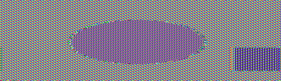
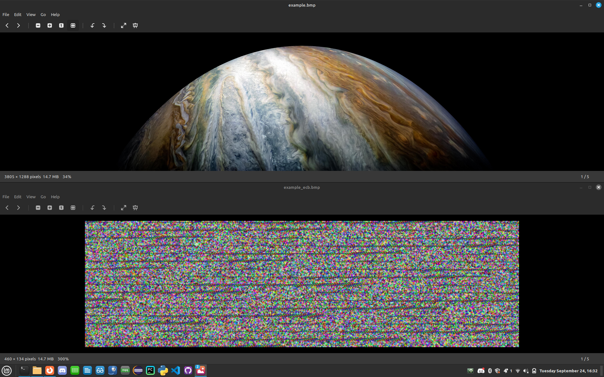

[](https://classroom.github.com/a/y99HrwDT)
[](https://classroom.github.com/open-in-codespaces?assignment_repo_id=16135882)
# Lab 3 : CEG 3400

### Encryption

#### Name: Alec Porter

---

### Task 1 - Symmetric Encryption

* Embed and desribe (use your words) each image
  * *CBC*:
    > Looks like random colored static.
    > 
    > 
  * *ECB*:
    > Looks like a zoomed in lcd screen where you can see the individual pixels of an image.
    > You can make out the shapes in the image and differentiate darker/lighter colors for the shapes.
    >
    > 
  * *OFB*:
    > Looks like random colored static.
    >
    > 
* Are you able to infer anything about the original image?
  > You are not able to infer anything about the original image from CBC or OFB encrpyting.  You are able to infer shapes and differentiate between light and dark colors in the ECB encrypted image. 
* Why do you think this is?  Dig into the typed of each encryption algorithm and explain.
  > CBC, ECB, and OFB are all types of block cipers where the picture is encrypted in blocks of data.
  >
  > ECB is the simplest of the three.  ECB divides the data into blocks and each block is encrypted separately from the rest.  Due to the simple nature of the ECB algorithm, it lacks diffusion.  Diffusion is a property of encryption similar to the avalanche effect in hashing where changing input data should have a major effect on the output.  Because ECD lacks diffusion, changes on individual blocks of data in the picture can be reflected in the encrypted picture.  This is especially true when there are large areas of uniform colors.  The lack of diffusion means that even though the blocks of data are encrypted, large areas with uniform color create a pattern that reflect the shape of objects in the original picture.  Pictures with complex patterns should be difficult to ascertain from the encrypted file.  Below is an example of a picture of Jupiter and it's ECB encryption. With the naked eye it's difficult, if not impossible, to relate anything in the encrypted image to the original image.
  >
  > 
  > I also tried encrypting the original picture with a more complex password (24 characters with 6 uppercase letters, 6 lowercase letters, 6 numbers, and 6 symbols) and that had minimal effect on the encrypted output.  I was still able to see an oval and square in the encrypted image.
  >
  > CBC and OFB are more complex and encypt plain text blocks with previously ciphered blocks using an XOR.  This makes each block look random when compared to other blocks even if those other blocks are the same color.  That is why the CBC and OFB encrypted images look like random colors.
  > 
```bash
please put any cool bash one-liners or other piped commands you
learned/struggled with for task here
```

---

### Task 2 - Asymmetric Encryption

* List all of the people that should be able to decrypt `task2.enc`
  > If you encrypt a file with someone's public key, only the private key of that individual can decrypt the file. Only Matthew Kijowski can decrypt the message with his private key.
* What key should be used to encrypt this file so that the instructor can guarantee that
  you encrypted it?
  > I would encrypt it with my private key so he verify its authenticity by decrypting it with my public key.

---

### Task 3 - Encrypted Email

* What is the benefit to you for having set this up?  Please be verbose and dicuss what additional
  protections having gpg encryption layerd into your email account provides.
  > It provides confidentiality and integrity.  Encryption provides confidentiality by providing end-to-end encryption.  This is a great tool when sending information you don't want other people reading.  I protects sensitive information such as PII, financial data, etc.  It also provides integrity through the use of digital signatures.  Your digital signature can be validated by other individuals so they know that not only the message come from you, but it arrived unaltered.  Once a digital signature is applied to data, the data can't be changed without invalidating the digital signature.  

---

### Task 4 - Digital Signatures

* What key would a recipient need to verify your signature?
  > They need your public key. If they can decrypt the data with your public key, they know that the data was encypted with your private key.
* Why is it important that you not change the file after signing it?
  > Changing the file after signing it invalidates the signature.  The individual receiving the data won't be able to tell what was changed or by whom.  If you need to change something you must sign the data again, resend it, and let the individual know to disregard the previous data.


