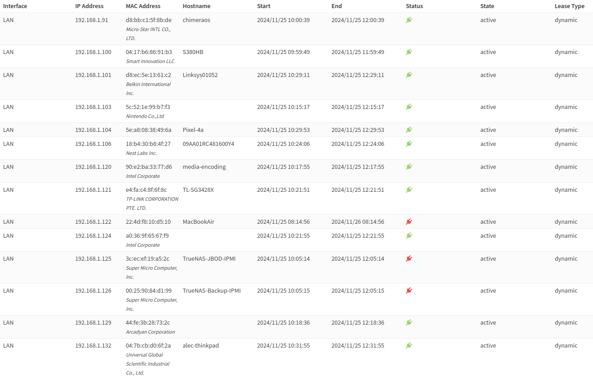

[](https://classroom.github.com/a/xJuhvB5m)
# Lab 6 : CEG 3400 Intro to Cyber Security

## Name:

### Task 1: `/home` sweet `/home`

Answer the following:

* What are all CIDR's in use in your home network?
> My home network is 192.168.1.0/24 which allows for a total of 256 ip addresses and at monst 254 devices.
* List all IP addresses that respond to a basic nmap scan.
> I scanned my network using `nmap 192.168.1.0/24` in its current state.  The scan covered devices currently in use, but it does not represent the entierty of the devices I have that could be on the network (e.g. PS5, Xbox Series X, etc. that are powered off when I'm not using them).
```
Starting Nmap 7.80 ( https://nmap.org ) at 2024-11-25 10:33 EST
Nmap scan report for OPNsense.localdomain (192.168.1.1)
Host is up (0.0042s latency).
Not shown: 997 filtered ports
PORT    STATE SERVICE
53/tcp  open  domain
80/tcp  open  http
443/tcp open  https

Nmap scan report for 192.168.1.2
Host is up (0.0025s latency).
Not shown: 997 closed ports
PORT     STATE SERVICE
22/tcp   open  ssh
111/tcp  open  rpcbind
3128/tcp open  squid-http

Nmap scan report for 192.168.1.91
Host is up (0.0027s latency).
Not shown: 998 closed ports
PORT     STATE SERVICE
22/tcp   open  ssh
2121/tcp open  ccproxy-ftp

Nmap scan report for 192.168.1.100
Host is up (0.0059s latency).
Not shown: 998 closed ports
PORT    STATE SERVICE
53/tcp  open  domain
554/tcp open  rtsp

Nmap scan report for 192.168.1.101
Host is up (0.0027s latency).
Not shown: 995 closed ports
PORT      STATE SERVICE
80/tcp    open  http
443/tcp   open  https
8080/tcp  open  http-proxy
10000/tcp open  snet-sensor-mgmt
49152/tcp open  unknown

Nmap scan report for 192.168.1.104
Host is up (0.0045s latency).
Not shown: 999 closed ports
PORT     STATE    SERVICE
5060/tcp filtered sip

Nmap scan report for 192.168.1.121
Host is up (0.019s latency).
Not shown: 996 closed ports
PORT    STATE SERVICE
22/tcp  open  ssh
23/tcp  open  telnet
80/tcp  open  http
443/tcp open  https

Nmap scan report for 192.168.1.124
Host is up (0.0027s latency).
Not shown: 993 closed ports
PORT     STATE SERVICE
22/tcp   open  ssh
80/tcp   open  http
111/tcp  open  rpcbind
139/tcp  open  netbios-ssn
443/tcp  open  https
445/tcp  open  microsoft-ds
5357/tcp open  wsdapi

Nmap scan report for 192.168.1.125
Host is up (0.0032s latency).
Not shown: 997 closed ports
PORT    STATE SERVICE
22/tcp  open  ssh
80/tcp  open  http
443/tcp open  https

Nmap scan report for 192.168.1.126
Host is up (0.0035s latency).
Not shown: 997 closed ports
PORT     STATE SERVICE
80/tcp   open  http
443/tcp  open  https
5900/tcp open  vnc

Nmap scan report for 192.168.1.129
Host is up (0.016s latency).
Not shown: 995 closed ports
PORT      STATE SERVICE
80/tcp    open  http
7000/tcp  open  afs3-fileserver
49153/tcp open  unknown
49154/tcp open  unknown
50000/tcp open  ibm-db2

Nmap scan report for alec-thinkpad (192.168.1.132)
Host is up (0.00020s latency).
Not shown: 999 closed ports
PORT   STATE SERVICE
25/tcp open  smtp

Nmap done: 256 IP addresses (12 hosts up) scanned in 6.65 seconds

```
* Can you identify all devices on your network?
> I was able to identify all devices listed in the nmap scan.  I use OPNsense as my router/firewall and can view the assigned IP address.
> 
> 
> There are some differences in the nmap scan IP list and the IP list from OPNsense:
> <ul>
> <li>OPNsense isn't showing 192.168.1.2 which is my Proxmox hypervisor.  This is because I set the IP address during Proxmox installation and it doesn't need an IP address assigned to it.</l1>
> <li>OPNsense shows my MacBook Air status as offline (red plug) but because the DHCP lease is still active the device is still showing in the DHCP lease table. </li>
> <li>OPNsense shows my Nintendo Swith as online and active but nmap did not dectect that device.  The Switch was in its dock on standby mode.  I was able to ping the Switch but running nmap on its IP address returned the following message "Note: Host seems down. If it is really up, but blocking our ping probes, try -Pn". I ran nmap with the -Pn option (Post scans only and no host discovery) and it eventually determined the host was up but it took around 2 minutes to run that scan.  I turned on my XBox Series X and ran into the same issue.  I needed to change the scan using different options (-Pn or -sS) to detect the consoles.</li>
> <li>OPNsense shows my IoT thermostat but nmap did not detect that device and I can't ping the device.  Just like the consoles, running the -Pn option detected the device.</li>
> <li>nmap did not detect my PC running a VPN until I ran the scan with the -Pn or -sS option.</li>
> </ul>
>  
> I was able to identify all the devices from the nmap scan but found out that a simple scan using `nmap 192.168.1.0/24` was not sufficient to identify all devices on my network.  I would need to a more indepth scan using a variety of options that would take considerably longer than the standard scan.

* How many online accounts and social media platforms are you on that hold non-trivial data about you?
> I counted at least 32 sites that have non-trivial data about me.  
* How many of these are critical for your organizations business goals?
> Of the 32 sites identified, 20 of them are critical to my "business goals".  
* Do you know the Authentication policies of these critical accounts?
> All of these accouts have some form of 2 factor authentication.  
* List all primary and secondary authentication methods for your most important account, including non password related reset options that might be vulnerable to an attacker.
> The accout I chose uses a password as the primary authentication method and phone as the secondary method to validate.  I can also have it send a code to my email as the secondary authentication method.  It also requires you to change the password every 150 days.  It was past time for me to change my password so I did.  I received a text and email stating the password had been changed.  When I tried to log in with the new password I fat fingered the new password three times and I was locked out of the account and an email and text notificaiton were immediately send out.  In order gain access to the account I was required to reset my password.  The password reset required two pieces of additional information to proceed.  I also had to wait 24 hours to reset the password because the system does not allow more than one password reset in a 24 hour period.
>
> While this process was a pain for me, it is a deterrent for someone else who would be trying to gain access to that account.  The account sends out text and email messages immediately when passwords are reset, the account is locked due to failed attempts, and when the accout is successfully accessed.  There don't appear to be any non-password related reset options.  Any options I changed in the account required a password.

---

### Task 2: Platform Inventory

Answer the following:

* My three Platforms (CPE's) (please provide both a link and a common name/version):
  1. [cpe:2.3:o:linux:linux_kernel:6.8:-:\*:\*:\*:\*:\*:\*](https://nvd.nist.gov/products/cpe/detail/E606D576-BCBB-484B-8F66-5D5EC7155998?namingFormat=2.3&orderBy=CPEURI&keyword=cpe%3A2.3%3Ao%3Alinux%3Alinux_kernel%3A6.8%3A-%3A*%3A*%3A*%3A*%3A*%3A*&status=FINAL%2CDEPRECATED)
  > I use Linux Mint on my school laptop and it's running kernel 6.8.0.  
  2. [cpe:2.3:o:freebsd:freebsd:14.0:-:\*:\*:\*:\*:\*:\*](https://nvd.nist.gov/products/cpe/detail/82330AAF-50A4-479B-805B-471298D9E6C4?namingFormat=2.3&orderBy=CPEURI&keyword=cpe%3A2.3%3Ao%3Afreebsd%3Afreebsd%3A14.0%3A-%3A*%3A*%3A*%3A*%3A*%3A*&status=FINAL%2CDEPRECATED)
  > My home router/firewall is a virtual machine running OPNsense which is based on FreeBSD.
  3. [cpe:2.3:a:mozilla:firefox:131.0.3:\*:\*:\*:-:\*:\*:\*](https://nvd.nist.gov/products/cpe/detail/8318BADD-5879-4200-9F06-F30E78B85647?namingFormat=2.3&orderBy=CPEURI&keyword=cpe%3A2.3%3Aa%3Amozilla%3Afirefox%3A131.0.3%3A*%3A*%3A*%3A-%3A*%3A*%3A*&status=FINAL%2CDEPRECATED)
  > Firefox is the web browser I primarily use for home and school.
* Why might having the CPE lookup for your most critical software be important for an organization to mitigate risk?
  > In order to mitigate risk, you need to identify, estimate, and priotize risk based on your organization's operations.  The CPE Dicitonary and online search tool provide a structured approach for identifiying software packages and linking known vulerabilites to those packages via CVEs.
* Which CPE has the most CVE's since Jan 1, 2023?  How many?
  > It is cpe:2.3:o:linux:linux_kernel:6.8:-:\*:\*:\*:\*:\*:\* by a large margin.  There are 52 pages of CVEs (not individual CVEs, but pages with 20 entries per page) for a total of 1041 by my count; however, the overwhelming percentage of them have been resolved. 
* What is the highest CVSS score of any 2024 CVE related to one of your CPE's?  Link the CVE.
  > [CVE-2024-43102](https://nvd.nist.gov/vuln/detail/CVE-2024-43102) has a CVSS score of 10.0.  The score is high because it allows for reuse of memory after it has been freed: [CWE-416](https://cwe.mitre.org/data/definitions/416.html).  This exploit can lead to data corruption, process crash, or execution of arbitrary code.  This impacts all three areas of the CIA triad and the severity is high because it leads to exploits at the kernal level

* My three vulnerabilities (CVE's) (please provide both a link and a common name, a CVSS score, and a summary of each):

##### [CVE-2024-10462](https://nvd.nist.gov/vuln/detail/CVE-2024-10462)

> This is one of the CVEs for Firefox (cpe:2.3:o:linux:linux_kernel:6.8:-:\*:\*:\*:\*:\*:\*). Origin spoofing using truncation of long URLs can be used with a permission prompt to allow an attacker access to resources they are not authorized access to.  This vulnerability is tied to CWE-290: Authentication Bypass by Spoofing.  This has a CVSS score of 6.5 Medium.

##### [CVE-2024-32668](https://nvd.nist.gov/vuln/detail/CVE-2024-32668)

> This is one of the CVEs for FreeBSD 14.0 (cpe:2.3:o:freebsd:freebsd:14.0:-:\*:\*:\*:\*:\*:\*).  Malicious software running on a guest VM can exploit an out-of-bounds write volunerability due to insufficient memory boundary validation to execute code on the host system.  This vulnerability is tied to CWE-787: Out-ofbounds Write.  This has a CVSS score of 8.2 High.

##### [CVE-2024-1151](https://nvd.nist.gov/vuln/detail/CVE-2024-1151)

> This is one of the CVEs for Linux Kernel 6.8 (cpe:2.3:o:linux:linux_kernel:6.8:-:\*:\*:\*:\*:\*:\*) that has not been resolved.  This vulnerability can trigger a stack overflow through the use of a recursive operation of code push.  This vulnerability can lead to system instability or crashes.  This vulnerability is tied to CWE-121: Stack-based Buffer Overflow.  This has a CVSS score of 5.5 Medium.

#### [Gather Victim Identity Information](https://attack.mitre.org/techniques/T1589/)

> This reconnaissance technique is where the adversary gathers information about the victim's identity that can be used during targeting.  This can easily be accomplish by gathering data already available on the open web or by more complex techniques like phishing.  This is most concerning to me because it can lead to compromise of personal accounts whether it be email or, most critical of all, financial.  I've lived in a lot of different areas and lost track of the websites, forums, etc. that I set up accounts on.  Most of these sites don't contain any important information, but each little piece discovered builds a more complete picture and aids in techniques like phishing the could be used to eploit me, or people I know by posing as me to get information.

---

### Task 3: Guess who

* List the top three threat vectors based on how likely they are to exploit your CPE/CVE's above.
  1. Cyber Criminals - CVE-2024-10462
  2. Insider Threats - CVE-2024-32668 and CVE-2024-1151
  3. Malicious Software - CVE-2024-32668
* Why did you choose these three and rank them as you did?
  > I chose cyber criminals trying to expliot the Firefox vulnerability as my top threat because it can be done over the network, the complexity is low, no privileges are required, and no user interaction is required.  A successful origin spoof could allow criminals access to sensitive and/or valuable information.
  > 
  > The next most likely threat vector would be insider threats exploiting the FreeBSD and Linux kernel vulnerabilities.  Both of these vulnerabilities require someone to have access to the local system.  It's most likely that an insider would have access to the local systems and could cause harm whether intentionally or unintentionally. The FreeBSD vulnerability allows for the execution of arbitrary code but it requires privileged access to the computer and the ability to create a VM.  An inside threat would have the ability to do this while an outside threat would not.  The Linux kernel vulnerability also requires local access to the system but impact of an attack is a system crash so the potential impact is far less than the Free BSD vulnerability.
  > 
  > The least likely attack vector of the three is malicious software.  The FreeBSD vulnerability allows for execution of malicious code, however, the attacker would first need access to the system to set up the required parameters to inject the malicious code.

* List the top three threat vectors based on how likely they are to exploit the CWE chosen for your homework.
  > The CWE example I chose for the previous lab was:  Improper Input Validation vulnerability exists in PowerLogic EGX100 (Versions 3.0.0 and newer) and PowerLogic EGX300 (All Versions) that could cause denial of service or remote code execution via a specially crafted HTTP packet.
  1. State-Sponsored Attackers
  2. Cyber Terrorists
  3. Cyber Criminals
* Why did you choose these three and rank them as you did?
  > The CWE I chose is a vulnerability in electrical and power system monitoring that could result in denial of service or remote code execution.  Cyber threats to the power grid and power systems are on the rise according to this DOE [source](https://www.eenews.net/articles/tensions-at-home-and-abroad-pose-growing-threat-to-us-grid/).  The two largest threats are state-sponsored attackers who have the manpower and finances to conduct large-scale attacks, and cyber terrorists who want to disrupt critical infrastructure.  Disrupting power systems can have a major impact on critical infrastructure and US government operations, and are a key target of many nations who conduct cyber operations and asymmetric warfare.  Disrupting power systems can wreak havoc and therefore are a prime target for terrorists.  Finally, a large corporation like Schneider Electric is a prime targe for cyber criminals.  Schinder Electric has had three major ransomeware incidents in the past 18 months [source](https://cyberscoop.com/schneider-electric-energy-ransomware-hellcat/).
  >
  > State-sponsored attackers are the top threat due to their ability to conduct large scale prolonged attacks.  The size and vulnerability of power systems make them ripe for terrorist attacks and the criticality of the systems/data with large businesses involved make them a tempting target for criminals.

* List the top three threat vectors based on how likely they are to exploit your MITRE ATT&CK Recon technique above.
  1. Cyber Criminals
  2. Script Kiddie
  3. State-Sponsored Attackers
* Why did you choose these three and rank them as you did?
  > Cyber criminals would be the most likely attacker looking for personal information about my identity that can be used during targeting.  This allows the criminals to build a profile so they can more successfully implement attacks on me via phishing or pose as me to exploit those who know me.  Their primary goal would be financial and I or close family members would be a tempting target.
  > 
  > There are a lot of tools available for free or sale that can be used to scrape information about me.  This makes it easy for script kiddies to find information on individuals whether it be to troll them or for personal gain.
  >
  > State-sponsored attackers are also a possibility given I worked for the Department of Defense for 21 years as an Air Force Acquisition Officer.  The fact that I no longer work in the DoD reduces the currently likelihood of attack, but my knowledge and experience with weapon system acquisition still makes me a potential target to exploit.

---

### Task 4, 5, & 6 chart:

Please get full name of threat event from instructions.  Use the 0-10 scale 
for all likelihood, impact, and risk fields.

| **Threat Event**         | **Likelihood** | **Impact** | **Risk** |
| ---                      | ---            | ---        | ---      |
| Network recon            |8                |2            |3          |
| Network Sniffing         |7                |2            |3          |
| Spear Phishing           |4                |2            |2          |
| Exploit IT configuration |4                |3            |3          |
| Exploit new vulnerability|8                |8            |8          |
| Denial of Service        |2                |2            |2          |
| Integrity loss of data   |2                |2            |2          |
| Unauthorized disclosure  |2                |2            |2          |
| Obtain sensitive data    |8                |5            |7          |
| Obfuscate actions        |3                |3            |3          |
| ***non-adversarial***    | ---            | ---        | ---      |
| Mishandling data         |4                |5            |4          |
| Communications contention|1                |1            |1         | 
| Unreadable display       |1                |1            |1          |
| Natural disaster         |2                |8            |5          |
| Software vulnerability   |5                |2            |3          |
| Disk Error               |2                |2            |2          | 

>- Network Recon: Likelihood is High (easy to run network scans); Impact is Low (adversary may learn some details on OS/software used but all default passwords have been changed and software is updated constantly); Risk is Low.  
>- Network Sniffing: Likelihood is High (easy to do on wireless network); Impact is Low (adversary may learn some details on OS/software used but all default passwords have been changed and software is updated constantly): Risk is Low.  
>- Spear Phishing: Likelihood is Moderate (past government knowledge/experience is a target); Impact is Low (I've had lots of training to avoid targeted attacks); Risk is Low.  
>- Exploit IT Config: Likelihood is Low (no default passwords used, systems kept up-to-date, don't use IoT); Impact is Low (potential to exploit external security cameras but that data is not critical); Risk is Low.  
>- Exploit New Vulnerability: Likelihood is High (best way for adversary to compromise systems); Impact is High (potential to lose critical info or have financial impact); Risk is High.  
>- DoS: Likelihood is Low (no incentive to conduct DoS on home network); Impact is Low (don't use cloud services, all data is local, 4G/5G network can be used); Risk is Low.  
>- Integrity Loss: Likelihood is Low (no incentive to corrupt data): Impact is Low (data backed up on connected and disconnected systems/devices); Risk is Low.  
>- Unauthorized Disclosure: Likelihood is Low (home network with only one user, systems not segregated due to classification/sensitivity); Impact is Low (only one user on network); Risk is Low.  
>- Obtain Sensitive Data: Likelihood is High (public systems are high priority targets and I've had data compromised in the past); Impact is Moderate (potential for significant financial harm depending on compromised data); Risk is High.  
>- Obfuscate Actions: Likelihood is Low (no incentive to obfuscate presence for long term data collection); Impact is Low (monitoring network activities provides minimal info to adversary); Risk is Low.  
>- Mishandling Data: Likelihood is Moderate (a lot of data on several machines with backups managed by hand); Impact is Moderate (loss/compromise of some data could lead to significant damage); Risk is Moderate.  
>- Communications Contention: Likelihood is Low (only person on the network); Impact is Low (high end router manages network data); Risk is Low.
>- Unreadable Display: Likelihood is Low (I have several monitors, the laptop has a dedicated HDMI port, I can ssh into the critical systems); Impact is Low (can easily get data if monitor is unusable); Risk is Low.  
>- Natural Disaster: Likelihood is Low (not in a flood zone, tornadoes/earthquakes are infrequent, fire is the most likely); Impact is High (a large natural disaster could destroy a lot of critical data and I don't use cloud backups); Risk is Moderate.  
>- Software Vulnerability: Likelihood is moderate (software vulnerabilities are common); Impact is Low (Linux vulnerabilities are quickly patched); Risk is Low.  
>- Disk Error: Likelihood is low (typical disk lifespan is 7-10 years or more depending on use,); Impact is Low (backup drives used and data stored on RAID arrays); Risk is low.  

---

### Task 4: Eventually

1. List one other threat event that is likely and of concern to your organization.
  > Insert untargeted malware into downloadable software and/or into commercial information technology products.
2. Why did you choose this threat event?
  > I've been migrating to free and open source software over the past few years and the majority of the operating systems and software I use is now open source.  I'm constantly trying open source packages from Linux repositories or from searching online.  There have been instances where software in the Linux repositories contained malware and free software is often a target for malware.
4. Were there any other threat events that your organization should be concerned about?
  > Yes, the list of adversary and non-adversary treat events is long and several more could apply to me.
5. What are the pros and cons of using a list of threat events such as the one included
   in the NIST 800-20 tables E-2 and E-3?
  > The major pro of using the list of threat events is that it provides a standardized list of definitions that can be used by a team working on a threat assessment.  There is no need for the team to identify and define threat events which saves time and using the list keeps everyone on the same page.  The con of using a standard list is that it could miss unique threat events to an organization.

---

### Task 5: Impact

There are no further questions for task 4.


---

### Task 6: Risky business

1. Add up all numbers in your risk column and list it here:
   > 51
2. What threat events were hardest to determine the likelihood, and impact for? Why?
   > Events like obfuscate actions because I found it difficult to image the benefit for the adverasy of doing that to me.  
3. What areas would you target for risk mitigation?
   > Obtain sensitive data/information from publicly accessible information systems.  This is my largest vulnerability and the most likely one that can be exploited.  Exploit new vulnerability was also a high risk but very difficult for me to mitigate other than ensuring my systems are contantly kept up-to-date.
4. What was the hardest part of this assessment (for you) and why?
   > Trying to estimate the likelihood.  I've done some risk identification and analysis for non IT systems but the adversaries were well known and defined.  With IT systems you have a wide range of adversaries, from people who inadvertently do damage to nation states with sophisticated tools, and that made it difficult to identify the likelihood for me.


